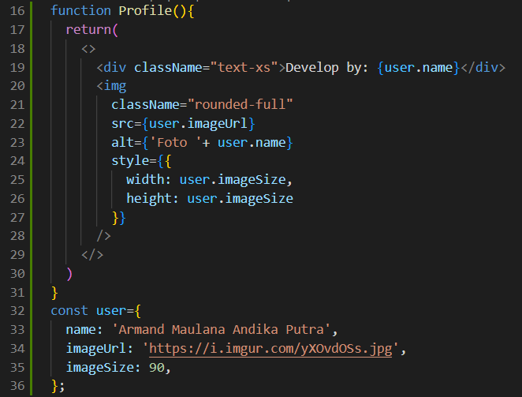

# Praktikum 1 :  Menyiapkan Lingkungan Pengembangan
## Pertanyaan Praktikum 1
1. Jelaskan kegunaan masing-masing dari Git, VS Code dan NodeJS yang telah Anda install
pada sesi praktikum ini!
2. Buktikan dengan screenshoot yang menunjukkan bahwa masing-masing tools tersebut
telah berhasil terinstall di perangkat Anda!

## Jawaban
1. - Git adalah VCS (Version Control System) yang digunakan untuk melacak perubahan pada kode sumber dalam pengembangan perangkat lunak. Kegunaanya adalah membantu developer bekerja secara kolaboratif tanpa risiko kehilangan data.
    - VS Code adalah kode editor yang mendukung berbagai bahasa pemrograman seperti JavaScript, Python, Java, dan lainnya. Kegunaanya adalah membantu developer menulis kode dengan lebih cepat dan efisien dengan ekstensi yang telah disediakan untuk meningkatkan produktivitas, seperti debugger, Git integration, dan AI-powered code assistance.
    - NodeJS adalah runtime environment yang memungkinkan pengembang untuk membuat aplikasi web. Bisa digunakan untuk membangun REST API, microservices, dan server-side rendering dengan framework seperti Next.js atau Express.js.

2. Screenshot:

    

# Praktikum 2
1. Membuat folder proyek baru dengan nama belajar-react. Melalui konsol/command prompt/CMD masuk ke dalam folder tersebut dan jalankan perintah ini: 

    **npx create-next-app** 

2. Buat proyek baru dengan nama hello-world seperti di bawah ini. Nama proyek ini perlu dimasukkan pertama kali melalui konsol.

    

3. Buka folder proyek hello-world menggunakan VS Code. Masuk ke dalam folder proyek helloworld dengan perintah: 

    **cd hello-world** 

    Kemudian setelah masuk ke folder hello-world, masukkan perintah: 

    **code .** 

    Maka VS Code akan membuka project react Anda yang telah dibuat bernama hello-world. Dan akan menampilkan struktur folder proyek seperti di bawah ini. 

    
4. Running proyek hello-world dengan memasukkan perintah di bawah ini melalui konsol atau terminal di dalam VS Code.

    **npm run dev** 

    Tunggu proses kompilasi hingga selesai. Lalu Anda dapat membuka alamat localhost di browser: http://localhost:3000/
'
    

    
## Pertanyaan Praktikum 2
1. Pada Langkah ke-2, setelah membuat proyek baru menggunakan Next.js, terdapat beberapa istilah yang muncul. Jelaskan istilah tersebut, TypeScript, ESLint, Tailwind CSS, App Router, Import alias, App router, dan Turbopack! 
2. Apa saja kegunaan folder dan file yang ada pada struktur proyek React yang tampil pada gambar pada tahap percobaan ke-3! 
3. Buktikan dengan screenshot yang menunjukkan bahwa tahapan percobaan di atas telah berhasil Anda lakukan!

## Jawaban
1. - TypeScript adalah superset dari JavaScript yang menambahkan static typing.
Membantu menghindari bug dengan mendeteksi kesalahan tipe data selama pengembangan.
    - ESLint adalah linter untuk JavaScript/TypeScript yang membantu memastikan kode ditulis dengan standar yang baik.
    Bisa mendeteksi kesalahan sintaks, penggunaan variabel yang tidak dipakai, dan gaya penulisan kode.
    - Tailwind CSS adalah framework CSS utility-first yang memungkinkan pembuatan tampilan dengan cepat menggunakan class CSS langsung di HTML/JSX.
    - App Router adalah fitur Next.js yang memungkinkan pembuatan routing aplikasi dengan cara yang lebih sederhana dan mudah.
    - Import alias adalah fitur Next.js yang memungkinkan penggunaan nama alias untuk import modul, sehingga kode menjadi lebih mudah dibaca dan diatur.
    - Turbopack adalah bundler baru pengganti Webpack yang dikembangkan oleh Vercel (pembuat Next.js) yang dapat mempercepat pengembangan dan hot reloading.
2. Folder:
    - node_modules/

            Folder untuk menyimpan semua dependensi yang diinstal melalui npm atau yarn.
    - public/

            Folder untuk menyimpan aset seperti gambar, ikon, atau file lain yang bisa diakses langsung melalui URL.
    - src/

            Folder utama untuk menyimpan kode aplikasi seperti komponen React, halaman, dan logic lainnya.

    File:
    - 
3. Screenshot:
    

# Praktikum 3
1. Di dalam folder proyek yang telah dibuka di VS Code, buka file page.tsx 
2. Tambahkan fungsi MyButton yang mengembalikan markup komponen button yang akan ditambahkan ke dalam webpage 
    
3. Tambahkan komponen button tersebut di samping button Read Our Docs. 

    
    Perhatikan bahwa komponen MyButton dimulai dengan huruf kapital. Dengan cara itulah Anda mengetahui bahwa itu adalah sebuah komponen React. Nama komponen React harus selalu dimulai dengan huruf kapital, sedangkan tag HTML harus menggunakan huruf kecil. Kata kunci export default menentukan komponen utama di dalam berkas (file). 
4. Simpan perubahan dan coba lihat perubahan melalui web browser! 
## Pertanyaan Praktikum 3
1. Buktikan dengan screenshoot yang menunjukkan bahwa tahapan percobaan di atas telah berhasil Anda lakukan! 
## Jawaban
1. Screenshot:

# Praktikum 4
1. Tambahkan kode JSX di bawah ini ke dalam file page.tsx.
    
2. Tambahkan komponen MyProfile setelah kompnen MyButton. 
    
3. Simpan dan amati perubahan di halaman web yang dihasilkan! 
## Pertanyaan Praktikum 4
1. Untuk apakah kegunaan sintaks user.imageUrl?
2. Buktikan dengan screenshoot yang menunjukkan bahwa tahapan percobaan di atas telah berhasil Anda lakukan!
## Jawaban
1. Untuk menampilkan gambar profil pengguna.
2. Screenshot:
